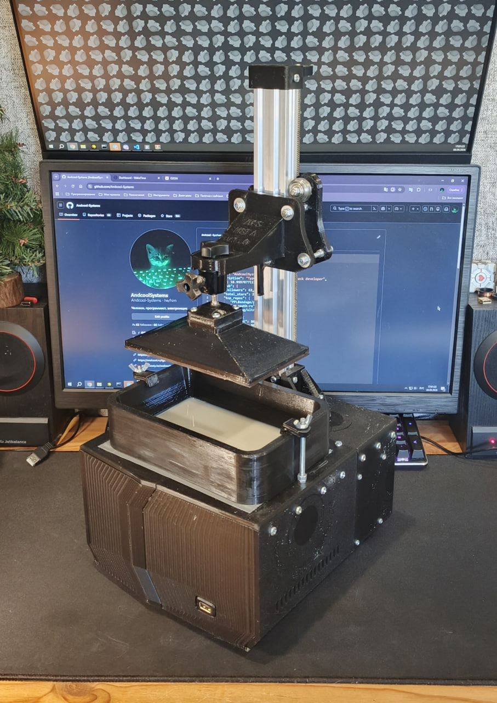

# DIY MSLA 3D Printer Core Code

## Daemon Features
- Fully async
- Reading `.zip` model files
- Interprets IR into printer commands
- Communicating with [peripheral](https://github.com/Andcool-Systems/msla-peripheral) ESP32 through custom byte- UART-based protocol
- Hosting a REST API for remote print controlling
- Allows to find printers in LAN
- Uses native Linux framebuffer to display layer images

### Project still under heavy dev!

---
**by AndcoolSystems, August 26, 2026**